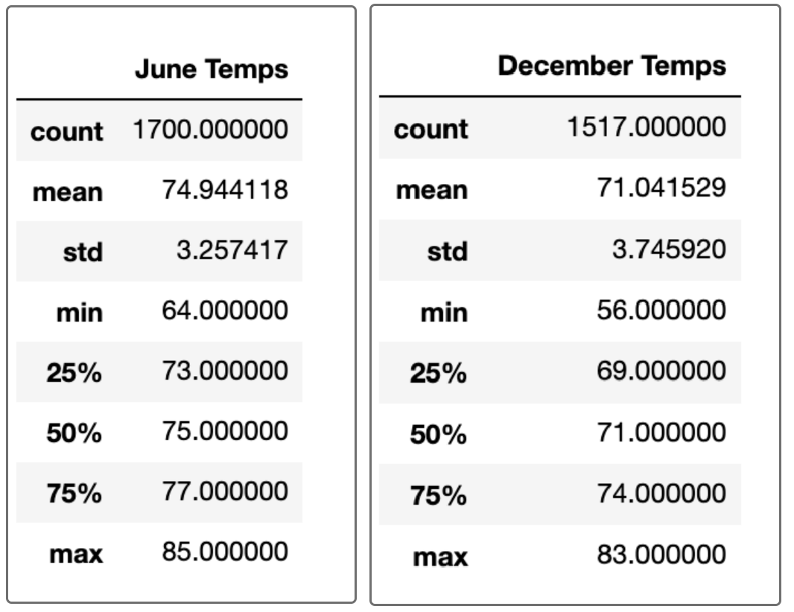

# Surfs Up Analysis
## Overview of Project
### Purpose of Project
In this project, I demonstrated my proficiency with various using Python, Pandas functions and methods, and SQLAlchemy to filter the date column of the measurements table in the database to retrieve all the temperatures for the month of June and December. Then I converted those temperatures to a list, created a DataFrame from the list, and generated the summary statistics. 
### Background of Project
I plan to open a surf supply and ice cream shop on Oachu. After putting together a business plan, I reached out to W. Avy, an investor, and he wants more information about temperature trends before opening the surf shop. Specifically, he wants temperature data for the months of June and December in Oahu, in order to determine if the surf and ice cream shop business is sustainable year-round.

---
## Results
June is a warmer month than December in O’ahu; however, the temperate difference between the months is inconsequential.  By and large June is approximately 2-4 degrees warmer across statistical comparisons. 
* June’s average temperate is 4 degrees warmer than December. June has an average temperature of 75 degrees while December averages 71 degrees. 
* Temperatures below 64 degrees and above 81 degrees in either month are rare. 95% of the temperatures in June fall between 68 degree and 81 and 95% of the temperatures in December fall between 64 degree and 79 degrees. 
* Although December has a low of 56 degrees in December compared to a low of 64 degrees in June, 56 degrees is so unusual (falls outside of 99.7% of the temperatures recorded in December) that it should not be a factor.  
The tables below compare the recorded temperatures in June and December respectively. 

 

---
## Summary 
Provide a high-level summary of the results and two additional queries that you would perform to gather more weather data for June and December.

There is a high-level summary of the results and there are two additional queries to perform to gather more weather data for June and December. 

In order to mentor the next generation, Pewlett-Hackard should consider expanding mentor requirements. Additional queries to consider:
* Would expanding the mentor requirements from 1 year to 3 years or 5 years be able to match at least 10% of retiring employees? 
* Rather than age or in addition to age, should Pewlett Hackard consider years of experience in the given job title as requirement for mentorship? 

